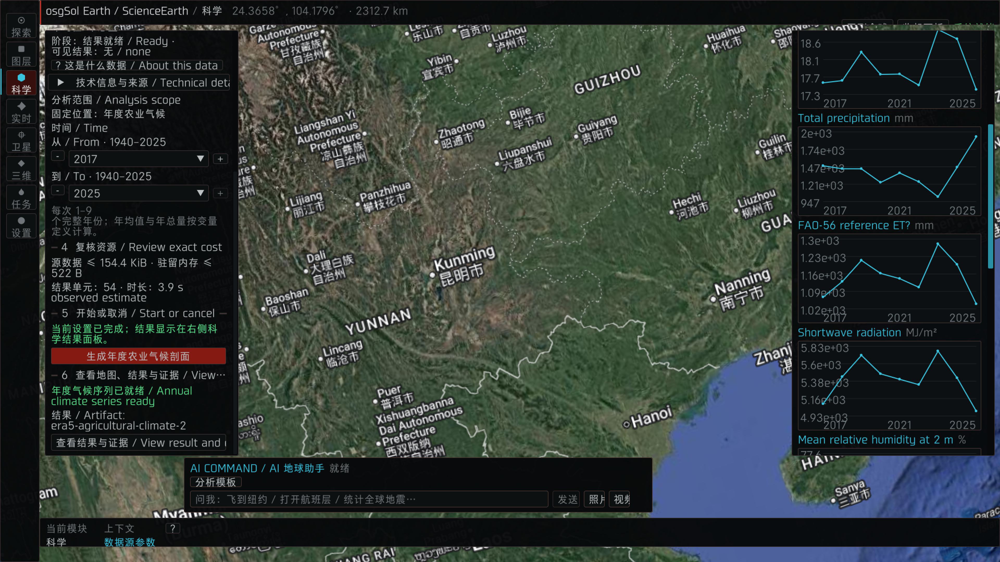
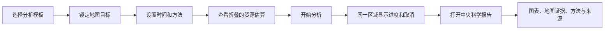

# ScienceEarth Scientific Workbench UI/UX Redesign Implementation Plan

> **For agentic workers:** REQUIRED SUB-SKILL: Use superpowers:executing-plans to implement this plan task-by-task. Steps use checkbox (`- [ ]`) syntax for tracking. Do not delegate this repository work unless the user explicitly requests delegation.

**Goal:** Replace the disconnected ScienceEarth setup text and narrow chart column with one map-bound analysis workflow and a central, movable, resizable, minimizable scientific report window, while preserving existing science calculations and all accepted Earth behavior.

**Architecture:** The science plugin remains responsible for source selection, query construction, execution, artifacts, and scientific provenance. The host owns the formal RmlUi product interface, map projection, window management, chart rendering, and context capture; a bounded versioned snapshot/action protocol crosses the plugin boundary. Point and grid-cell analysis is identified with a screen-space map overlay, never by modifying terrain geometry or imagery.

**Tech Stack:** C++17, OpenSceneGraph/osgEarth, RmlUi 6.2 static library, RML/RCSS, OpenGL, existing ScienceQueryService/ScienceArtifactStore, GoogleTest/CTest, macOS Objective-C++ IME bridge.

## Global Constraints

- Worktree: `/Users/USER/osgsol/.worktrees/v0.2-runtime-safety`; preserve the unrelated untracked `packaging/scienceearth/__pycache__/` and `tests/__pycache__/` directories.
- This redesign does not change ERA5, AlphaEarth, Sentinel-2, terrain, imagery, 3D Tiles, camera navigation, photo generation, video generation, AI tool semantics, or normal-exit behavior.
- A science query never moves the camera. `回到分析区域` is the only action that may request camera movement, and it is always user initiated.
- Point/grid-cell highlights are projected screen-space UI geometry with depth testing disabled. They are not terrain meshes, decals, rasters, or material overlays, so they cannot sink into terrain or produce z-fighting.
- A target is immutable after `LockTarget`; camera movement cannot silently change the submitted geometry. The user must explicitly choose `更新为当前视野` or `更新为地图中心`.
- Requested geometry and provider-returned geometry remain distinct. Requested geometry uses a dashed outline; actual grid support uses a solid outline and comes from `SourceReference::actualCoverage`.
- Chinese is the default product language. Dataset names, standards, units, and proper nouns retain their official spelling. Duplicate Chinese/English labels are removed from normal views and placed in help or developer mode.
- Red is reserved for failures, destructive actions, and destructive confirmation. The primary analysis action uses Carbon Spectrum cyan/teal.
- The formal UI uses RmlUi; ImGui remains a bounded legacy/debug fallback until the new UI passes manual acceptance.
- Closing or minimizing a report never deletes its artifact. Deletion is a separate confirmed action.
- Keep at most one open report and three minimized report entries; the existing artifact-store limit remains authoritative.
- Never launch or foreground the Desktop app during automated verification. The user performs the packaged-app visual and Quit checks.
- Packaging replaces the single formal Desktop app transactionally only after user acceptance; it does not create a second Desktop app.

---

## Evidence and problem statement

Current-state evidence:



SHA-256: `3b5f256d5ff84b79bcfb1c55543d4dfbe6925a02914c919f539f79de736ebeb3`

Visible defects in this state:

1. The map shows South China at `24.3658°, 104.1796°` and `2312.7 km`, but has no requested point, returned grid center, grid-cell boundary, view boundary, or target label. A reader cannot tell whether the curves describe the whole visible map or one provider grid cell.
2. The left drawer begins at steps 4–6 because it is scrolled. Source, scope, years, resource estimate, execution state, artifact identifier, evidence, and help are rendered as one dense stream instead of one coherent analysis request.
3. `阶段：结果就绪 / Ready` and `可见结果：无 / none` contradict the visible chart column.
4. The primary action is red, which communicates danger or failure rather than “run analysis.”
5. The right result column has no report title bar, target summary, source, period, method, drag, resize, minimize, or close behavior. It stacks every metric vertically and forces a long scroll.
6. Scientific notation such as `2e+03`, clipped headings, the unclear `ET?` glyph, and repeated bilingual labels make the charts harder to read than the underlying data requires.
7. Category selection, target, years, cost review, execution, and result viewing are physically separated even though they are one user task.

Evidence limit: the screenshot proves visual hierarchy and state-communication failures. It cannot prove keyboard focus, IME, pointer capture, wheel recovery, or screen-reader behavior; those remain explicit acceptance checks below.

## Target experience

### Stable shell

- Keep the existing left module rail and compact AI composer.
- Replace the Science drawer contents with a 340–380 px **分析设置** composer.
- Open results in a central floating **科学分析报告**, not a permanent third side column.
- Keep the map visible around the report and retain a live target overlay when the report is minimized.

### One connected workflow



The composer order is fixed:

1. **分析什么** — source-backed analysis template, one-sentence output description, spatial support, available years.
2. **分析哪里** — `地图中心点` or `当前视野`; requested location and expected spatial unit; explicit lock/update action.
3. **分析何时** — one grouped start/end control with a range strip and provider-valid limits.
4. **如何分析** — only source-relevant methods and options; hidden when a source has no choice.
5. **提交前检查** — collapsed by default; source bytes, estimated memory, cell count, and confidence in the estimate.
6. **开始/进度** — sticky footer with one CTA; the same footer becomes progress plus cancel while running.

### Map-bound target

- Before submission, draw the requested point or requested view boundary and the label `ERA5 农业气候 · 2017–2025`.
- After result arrival, preserve the requested marker and add the provider-returned center plus `actualCoverage` cell outline.
- If requested and returned locations differ, label the offset and show both geometries.
- The overlay is projected every frame from geodetic coordinates. It is hidden only when the geometry is behind the globe or outside the viewport.
- `回到分析区域` appears in the composer and report; it is never automatic.

### Central scientific report

- Default size: `900 × 680` logical pixels.
- Minimum size: `720 × 520`; maximum size: `80vw × 80vh`.
- At a `1024 × 576` viewport, enter compact mode with a `16 px` map margin and `680 × 500` maximum content area.
- Title bar: analysis name, source, state, drag handle, minimize, close. Resize handles are present on right, bottom, and bottom-right edges.
- Close hides the report. Minimize creates a compact shelf entry. Delete uses an overflow action plus confirmation.
- Report sections:
  - **概览** — target, source, period, spatial unit, context map thumbnail, data completeness, four key summaries.
  - **趋势** — metric selector plus one large chart; synchronized hover year; min/max/mean/change/trend summary.
  - **空间范围** — requested point/bounds, returned center, exact provider cell bounds/resolution, live-map focus action.
  - **方法与证据** — aggregation, units, missing-data policy, limitations, citations, source references, artifact ID, export.
- Never combine metrics with different units on one axis. Metric switching changes the one primary chart.
- Format values by unit: precipitation and evapotranspiration as rounded `mm`, temperature as `°C`, humidity as `%`, radiation as `MJ/m²`, coordinates to an accuracy justified by source resolution. Do not display `2e+03` for ordinary human-readable values.

## State model

```cpp
enum class ScienceWorkbenchPhase
{
    Draft,
    TargetLocked,
    ReadyToRun,
    Queued,
    Fetching,
    Analyzing,
    Ready,
    Failed,
    Cancelled
};
```

State rules:

- `Draft`: source/template may be selected; no immutable target exists.
- `TargetLocked`: requested point or bounds are frozen; camera changes update only a separate live-map context.
- `ReadyToRun`: target, years, required method, and resource review are valid.
- `Queued`, `Fetching`, `Analyzing`: the sticky footer shows phase, progress when measurable, elapsed time, and cancel.
- `Ready`: the report opens once and the map overlay adds actual provider coverage.
- `Failed` and `Cancelled`: the failed run is explained in place; an earlier valid report remains accessible and is marked `上一份结果`.

## Framework research basis

- RmlUi `6.2` is the current official release as of 2026-07-22 and is pinned rather than tracking a moving branch: [official releases](https://github.com/mikke89/RmlUi/releases).
- The host integration follows the official system/render interface model, which fits osgSol's existing render loop without replacing OSG: [integration guide](https://mikke89.github.io/RmlUiDoc/pages/cpp_manual/integrating.html) and [render interface](https://mikke89.github.io/RmlUiDoc/pages/cpp_manual/interfaces/render.html).
- Composer and report updates use RmlUi data bindings, while the chart is a registered custom element: [data bindings](https://mikke89.github.io/RmlUiDoc/pages/data_bindings.html) and [custom elements](https://mikke89.github.io/RmlUiDoc/pages/cpp_manual/custom_elements.html).
- Drag and resize use the built-in handle control rather than a second windowing library: [controls and handles](https://mikke89.github.io/RmlUiDoc/pages/rml/controls.html).
- The official IME matrix does not provide a default macOS backend, so Task 5 must adapt the existing Cocoa text-input bridge instead of claiming IME support from RmlUi alone: [IME integration](https://mikke89.github.io/RmlUiDoc/pages/cpp_manual/ime.html).
- Dependency acquisition is one pinned HTTPS archive from the official repository with a checked SHA-256. The implementation opens no local server, listener, or background network service.

## File responsibility map

### Science/plugin side

- `applications/earth_explorer/science_workbench_model.h/.cpp` — UI-independent draft, target lock, execution phase, report list, and action reducer.
- `applications/earth_explorer/science_workbench_protocol.h/.cpp` — bounded JSON snapshot and validated action wire format.
- `applications/earth_explorer/science_plugin_api.h` — ABI v4 copy/dispatch entry points while retaining ABI v3 drawing fallback.
- `applications/earth_explorer/science_plugin_entry.cpp` — adapts `ScienceQueryService`, `ScienceArtifactStore`, and source artifacts into the workbench model.
- `applications/earth_explorer/science_earth_panel.h/.cpp` — legacy ImGui fallback only; it delegates state changes to the workbench model.

### Host product UI

- `applications/earth_explorer/product_ui/rml_ui_runtime.h/.cpp` — RmlUi context lifetime and frame integration.
- `applications/earth_explorer/product_ui/rml_osg_renderer.h/.cpp` — RmlUi `RenderInterface` implementation over the existing OpenGL/OSG frame.
- `applications/earth_explorer/product_ui/rml_input_bridge.h/.cpp` — pointer, wheel, key, focus, and capture translation.
- `applications/earth_explorer/product_ui/rml_macos_ime.mm` — macOS marked-text and committed-text adapter using the existing IME behavior.
- `applications/earth_explorer/science_ui/science_workbench_presenter.h/.cpp` — consumes snapshots, emits actions, and binds the composer/report documents.
- `applications/earth_explorer/science_ui/science_target_overlay.h/.cpp` — projects requested and actual geodetic geometries into screen-space UI geometry.
- `applications/earth_explorer/science_ui/science_report_window.h/.cpp` — report position, size, minimize/close, active tab, metric, year cursor, and bounded shelf.
- `applications/earth_explorer/science_ui/science_chart_model.h/.cpp` — unit-aware formatting and chart-domain/statistics derivation.
- `applications/earth_explorer/science_ui/rml_science_chart.h/.cpp` — custom RmlUi chart element and hit testing.
- `applications/earth_explorer/science_ui/map_context_capture.h/.cpp` — pre-UI composed-map thumbnail with normalized target geometry.
- `assets/misc/ui/scienceearth/workbench.rml` — composer document.
- `assets/misc/ui/scienceearth/report.rml` — central report document.
- `assets/misc/ui/scienceearth/scienceearth.rcss` — component styling.
- `assets/misc/ui/scienceearth/tokens.rcss` — Carbon Spectrum-compatible color, typography, spacing, and elevation tokens.

### Build and tests

- `helpers/toolchain_builder/rmlui/CMakeLists.txt` — pinned RmlUi 6.2 static dependency target.
- `applications/earth_explorer/CMakeLists.txt` — product UI and test targets.
- `tests/science_workbench_model_tests.cpp` — reducer and target-lock behavior.
- `tests/science_workbench_protocol_tests.cpp` — ABI snapshot/action bounds and validation.
- `tests/science_target_overlay_tests.cpp` — projection, globe occlusion, antimeridian, and viewport clipping.
- `tests/science_report_window_tests.cpp` — drag/resize/minimize/close/shelf lifecycle.
- `tests/science_chart_model_tests.cpp` — units, formatting, statistics, missing values, and domain selection.
- `tests/map_context_capture_tests.cpp` — capture source, target normalization, lifecycle, and memory cap.
- `tests/rml_input_bridge_tests.cpp` — wheel recovery, pointer capture, key focus, and text-input routing.
- `tests/science_workbench_ui_contract_tests.cpp` — RML IDs, order, accessible names, CTA state, and language density.
- `tests/earth_control_layout_tests.cpp` — remove the old six-step/right-column assumptions and assert the new composer/report coexistence rules.

---

### Task 1: Freeze the visual and interaction contract

**Files:**
- Create: `docs/scienceearth/design/science-workbench-contract-2026-07-22.md`
- Use: `docs/scienceearth/design/2026-07-22-current-science-analysis.png`
- Modify: `docs/scienceearth/ui-modernization-decision-2026-07-20.md`

**Interfaces:**
- Consumes: the screenshot audit and the target experience in this plan.
- Produces: stable component names, dimensions, copy, states, and manual comparison views used by Tasks 6–10.

- [ ] **Step 1: Write the contract with exact acceptance views**

Document these five fixed views at `2048 × 1152`: empty composer, locked ERA5 point, running analysis, ready overview report, ready trends report. Every view uses realistic fields from the current ERA5 artifact schema and includes target geometry.

- [ ] **Step 2: Record interaction semantics**

Include this exact matrix:

| Control | Pointer | Keyboard | Result |
|---|---|---|---|
| Lock target | Click | Enter/Space | Freeze requested geometry |
| Year range | Drag/click | Arrow keys, Page Up/Down | Update both visible value and draft |
| Start | Click | Enter/Space | Submit frozen draft once |
| Cancel | Click | Enter/Space | Request cancellation, retain older report |
| Report title | Drag | — | Move within viewport |
| Report edge | Drag | — | Resize within min/max bounds |
| Minimize | Click | Enter/Space | Add one shelf entry |
| Close | Click | Escape when report focused | Hide without deleting |
| Map focus | Click | Enter/Space | Explicitly request camera focus |

- [ ] **Step 3: Add a preservation section**

List camera, terrain, imagery, 3D Tiles, photo/video, AI, Quit, bundle identity, plugin isolation, source calculations, and artifact provenance as unchanged contracts.

- [ ] **Step 4: Review the document against the supplied screenshot**

Expected: every visible defect in the Evidence section maps to a named component or state in the contract; no control is described only by color or position.

- [ ] **Step 5: Commit the contract**

```bash
git add docs/scienceearth/design/science-workbench-contract-2026-07-22.md \
  docs/scienceearth/design/2026-07-22-current-science-analysis.png \
  docs/scienceearth/ui-modernization-decision-2026-07-20.md
git commit -m "docs(scienceearth): define scientific workbench UX contract"
```

### Task 2: Extract the workbench state machine from ImGui rendering

**Files:**
- Create: `applications/earth_explorer/science_workbench_model.h`
- Create: `applications/earth_explorer/science_workbench_model.cpp`
- Create: `tests/science_workbench_model_tests.cpp`
- Modify: `applications/earth_explorer/science_earth_panel.h`
- Modify: `applications/earth_explorer/science_earth_panel.cpp`
- Modify: `applications/earth_explorer/CMakeLists.txt`

**Interfaces:**
- Consumes: `GeoTemporalQuery`, `ScienceJobSnapshot`, `ScienceArtifact`, `ScienceQueryCost`, and `ScienceArtifactStore`.
- Produces:

```cpp
struct ScienceTargetPresentation
{
    ScienceGeometry requested;
    ScienceGeometry actualCoverage;
    ScienceWgs84Point requestedCenter;
    ScienceWgs84Point returnedCenter;
    bool locked = false;
    bool hasActualCoverage = false;
};

struct ScienceWorkbenchViewModel
{
    std::uint64_t revision = 0;
    ScienceWorkbenchPhase phase = ScienceWorkbenchPhase::Draft;
    GeoTemporalQuery draft;
    ScienceTargetPresentation target;
    ScienceQueryCost cost;
    std::string activeArtifactId;
    std::vector<std::string> minimizedArtifactIds;
    std::string errorCode;
    std::string errorMessage;
};

enum class ScienceWorkbenchActionKind
{
    SelectSource, SelectAnalysis, LockMapCenter, LockCurrentView,
    UpdateLockedTarget, SetYearRange, SetMethod, Run, Cancel,
    OpenReport, MinimizeReport, CloseReport, RemoveArtifact,
    FocusTarget, SelectMetric, SelectYear
};

struct ScienceWorkbenchAction
{
    ScienceWorkbenchActionKind kind = ScienceWorkbenchActionKind::SelectSource;
    std::string sourceId;
    std::string analysisId;
    std::string methodId;
    std::string artifactId;
    std::string metricId;
    ScienceGeometry geometry;
    int firstYear = 0;
    int lastYear = 0;
    int selectedYear = 0;
};

class ScienceWorkbenchModel
{
public:
    void updateLiveCameraContext(const ScienceGeometry& mapCenterPoint,
                                 const ScienceGeometry& visibleBounds);
    bool dispatch(const ScienceWorkbenchAction& action, std::string& error);
    const ScienceWorkbenchViewModel& viewModel() const;
    std::optional<GeoTemporalQuery> takePendingSubmission();
    void applyProgress(const ScienceProgress& progress);
    void applyJobSnapshot(const ScienceJobSnapshot& snapshot);
    void applyArtifact(std::shared_ptr<const ScienceArtifact> artifact);
};
```

- [ ] **Step 1: Write failing reducer tests**

Cover: camera changes before lock update the candidate; camera changes after lock do not change the draft; `Run` is rejected until required fields are valid; `Run` emits exactly one frozen query; `CloseReport` keeps the artifact; `RemoveArtifact` removes it; failure preserves an older ready artifact.

- [ ] **Step 2: Run the focused tests and confirm failure**

Run:

```bash
cmake --build build/science_g3_release --target osgSol_Test_ScienceWorkbenchModel -j8
ctest --test-dir build/science_g3_release -R '^osgSol_Test_ScienceWorkbenchModel$' --output-on-failure
```

Expected: compile or link failure because `ScienceWorkbenchModel` does not exist.

- [ ] **Step 3: Implement the reducer and immutable target lock**

Use one reducer path for ImGui fallback and future RmlUi actions. Increment `revision` only when the public view model changes. `takePendingSubmission()` moves out one pending frozen query and cannot return it twice.

- [ ] **Step 4: Adapt the legacy panel without changing its visible behavior**

Replace direct state mutation in `drawOperations()` with `ScienceWorkbenchAction` dispatch. Keep the current ImGui drawing behind the same entry points so this commit is behavior-preserving.

- [ ] **Step 5: Run model and existing panel tests**

```bash
cmake --build build/science_g3_release --target \
  osgSol_Test_ScienceWorkbenchModel osgSol_Test_ScienceEarthPanel -j8
ctest --test-dir build/science_g3_release \
  -R '^osgSol_Test_(ScienceWorkbenchModel|ScienceEarthPanel)$' --output-on-failure
```

Expected: both tests pass; camera motion after target lock leaves the submitted geometry unchanged.

- [ ] **Step 6: Commit**

```bash
git add applications/earth_explorer/science_workbench_model.* \
  applications/earth_explorer/science_earth_panel.* \
  applications/earth_explorer/CMakeLists.txt \
  tests/science_workbench_model_tests.cpp
git commit -m "refactor(scienceearth): extract workbench state model"
```

### Task 3: Add the versioned plugin snapshot/action protocol

**Files:**
- Create: `applications/earth_explorer/science_workbench_protocol.h`
- Create: `applications/earth_explorer/science_workbench_protocol.cpp`
- Create: `tests/science_workbench_protocol_tests.cpp`
- Modify: `applications/earth_explorer/science_plugin_api.h`
- Modify: `applications/earth_explorer/science_plugin_entry.cpp`
- Modify: `applications/earth_explorer/science_plugin_runtime.h`
- Modify: `applications/earth_explorer/science_plugin_runtime.cpp`
- Modify: `tests/science_plugin_runtime_tests.cpp`
- Modify: `applications/earth_explorer/CMakeLists.txt`

**Interfaces:**
- Consumes: `ScienceWorkbenchViewModel` and `ScienceWorkbenchAction` from Task 2.
- Produces:

```cpp
struct OsgSolScienceUiBufferV1
{
    std::uint32_t structSize;
    std::uint64_t revision;
    char* utf8;
    std::size_t capacity;
    std::size_t bytesWritten;
    std::size_t bytesRequired;
};

struct OsgSolSciencePluginApiV4
{
    OsgSolSciencePluginApiV3 v3;
    bool (*copyWorkbenchSnapshot)(void*, OsgSolScienceUiBufferV1*);
    bool (*dispatchWorkbenchAction)(void*, const char*, std::size_t,
                                    char*, std::size_t);
};
```

Snapshot schema is `science-workbench-ui-v1`. Maximum snapshot size is `524288` bytes; maximum action size is `65536` bytes. Strings are UTF-8, numbers are finite, and no plugin-owned pointer escapes a call.

- [ ] **Step 1: Write failing protocol tests**

Assert deterministic serialization, exact `bytesRequired`, undersized-buffer rejection without partial JSON, unknown action rejection, invalid year-range rejection, invalid UTF-8 rejection, NaN rejection, and ABI v3 fallback when v4 is unavailable.

- [ ] **Step 2: Confirm the tests fail**

```bash
cmake --build build/science_g3_release --target \
  osgSol_Test_ScienceWorkbenchProtocol osgSol_Test_SciencePluginRuntime -j8
ctest --test-dir build/science_g3_release \
  -R '^osgSol_Test_(ScienceWorkbenchProtocol|SciencePluginRuntime)$' --output-on-failure
```

Expected: protocol target does not compile and runtime has no ABI v4 entry points.

- [ ] **Step 3: Implement bounded snapshot copying and action validation**

Serialize source/template metadata, valid years, target, cost, phase, progress, reports, metric series, source references, limitations, and errors. Dispatch only the enum actions defined in Task 2; return a short stable error code and localized message in the caller-owned response buffer.

- [ ] **Step 4: Preserve ABI v3 fallback**

Load v4 only when `structSize` and `abiVersion` prove the extra functions are present. Otherwise call existing `drawOperations` and `drawResults` exactly as before.

- [ ] **Step 5: Run contract tests**

```bash
ctest --test-dir build/science_g3_release \
  -R '^osgSol_Test_(ScienceWorkbenchProtocol|SciencePluginRuntime|SciencePluginContract)$' \
  --output-on-failure
```

Expected: all tests pass, including an ABI v3 fake plugin.

- [ ] **Step 6: Commit**

```bash
git add applications/earth_explorer/science_workbench_protocol.* \
  applications/earth_explorer/science_plugin_api.h \
  applications/earth_explorer/science_plugin_entry.cpp \
  applications/earth_explorer/science_plugin_runtime.* \
  applications/earth_explorer/CMakeLists.txt \
  tests/science_workbench_protocol_tests.cpp \
  tests/science_plugin_runtime_tests.cpp
git commit -m "feat(scienceearth): add workbench UI protocol"
```

### Task 4: Draw requested and actual analysis geometry above the map

**Files:**
- Create: `applications/earth_explorer/science_ui/science_target_overlay.h`
- Create: `applications/earth_explorer/science_ui/science_target_overlay.cpp`
- Create: `tests/science_target_overlay_tests.cpp`
- Modify: `applications/earth_explorer/CMakeLists.txt`
- Modify: `applications/earth_explorer/EarthControlUI.h`

**Interfaces:**
- Consumes: requested/actual geodetic geometry from the v4 snapshot and current OSG camera matrices.
- Produces:

```cpp
struct ScienceOverlayVertex { float x; float y; };
struct ScienceOverlayPath
{
    std::vector<ScienceOverlayVertex> vertices;
    bool closed = false;
    bool dashed = false;
};
struct ScienceTargetOverlayFrame
{
    std::vector<ScienceOverlayPath> requested;
    std::vector<ScienceOverlayPath> actual;
    osg::Vec2f labelAnchor;
    bool visible = false;
};

ScienceTargetOverlayFrame projectScienceTarget(
    const ScienceTargetPresentation& target,
    const osg::Matrixd& view,
    const osg::Matrixd& projection,
    const osg::Viewport& viewport);
```

- [ ] **Step 1: Write projection tests**

Use fixtures for Shenzhen/Hong Kong, Tokyo, Mount Fuji, a target crossing `180°`, a target behind the globe, and a cell partially outside the viewport. Assert finite screen coordinates, winding stability, clipping, and correct visibility.

- [ ] **Step 2: Confirm the tests fail**

```bash
cmake --build build/science_g3_release --target osgSol_Test_ScienceTargetOverlay -j8
ctest --test-dir build/science_g3_release -R '^osgSol_Test_ScienceTargetOverlay$' --output-on-failure
```

Expected: target or symbols are missing.

- [ ] **Step 3: Implement geodetic projection and globe occlusion**

Sample rectangle edges densely enough to follow the globe, split antimeridian crossings, reject segments whose Earth-centered normals face away from the camera, and clip in screen space. Render requested geometry dashed and actual coverage solid after all world rendering with depth testing disabled.

- [ ] **Step 4: Add overlay copy and focus action**

Show source, spatial unit, and years in one concise label. Route `回到分析区域` through `FocusTarget`; do not call the manipulator from snapshot receipt or report opening.

- [ ] **Step 5: Run tests and static terrain-boundary check**

```bash
ctest --test-dir build/science_g3_release -R '^osgSol_Test_ScienceTargetOverlay$' --output-on-failure
rg -n 'TerrainEngine|setElevation|createTile|ImageLayer|ElevationLayer' \
  applications/earth_explorer/science_ui/science_target_overlay.*
```

Expected: test passes; `rg` returns no matches.

- [ ] **Step 6: Commit**

```bash
git add applications/earth_explorer/science_ui/science_target_overlay.* \
  applications/earth_explorer/EarthControlUI.h \
  applications/earth_explorer/CMakeLists.txt \
  tests/science_target_overlay_tests.cpp
git commit -m "feat(scienceearth): show map-bound analysis target"
```

### Task 5: Integrate RmlUi 6.2 behind a disabled-by-default product-UI flag

**Files:**
- Create: `helpers/toolchain_builder/rmlui/CMakeLists.txt`
- Create: `applications/earth_explorer/product_ui/rml_ui_runtime.h`
- Create: `applications/earth_explorer/product_ui/rml_ui_runtime.cpp`
- Create: `applications/earth_explorer/product_ui/rml_osg_renderer.h`
- Create: `applications/earth_explorer/product_ui/rml_osg_renderer.cpp`
- Create: `applications/earth_explorer/product_ui/rml_input_bridge.h`
- Create: `applications/earth_explorer/product_ui/rml_input_bridge.cpp`
- Create: `applications/earth_explorer/product_ui/rml_macos_ime.mm`
- Create: `tests/rml_input_bridge_tests.cpp`
- Modify: `CMakeLists.txt`
- Modify: `applications/earth_explorer/CMakeLists.txt`
- Modify: `applications/earth_explorer/earth_main.cpp`
- Modify: `applications/earth_explorer/ime_bridge.h`
- Modify: `applications/earth_explorer/ime_bridge.mm`

**Interfaces:**
- Consumes: the existing OpenGL context, OSG frame order, input events, and macOS text bridge.
- Produces:

```cpp
class RmlUiRuntime
{
public:
    bool initialize(osg::GraphicsContext& graphics, float logicalDpi,
                    std::string& error);
    void processEvent(const osgGA::GUIEventAdapter& event);
    void update(double monotonicSeconds);
    void render();
    void shutdown();
    Rml::Context* context() const;
};
```

Build option: `OSGSOL_BUILD_RMLUI_PRODUCT_UI=ON|OFF`. Runtime selector: `OSGSOL_PRODUCT_UI=rml|legacy`. The first integration commit leaves the runtime default as `legacy`.

- [ ] **Step 1: Pin and verify the dependency**

Fetch or vendor the official `6.2` release with its MIT license, build `RmlCore` as a static C++17 target, and record the source URL and SHA-256 in `helpers/toolchain_builder/rmlui/CMakeLists.txt`.

- [ ] **Step 2: Write failing input tests**

Cover vertical wheel movement in both directions after reaching an edge, nested-scroll handoff, pointer capture release, focus transfer, Escape, Return, Chinese committed text, and marked-text replacement.

- [ ] **Step 3: Confirm the tests fail**

```bash
cmake -S . -B build/science_ui -DCMAKE_BUILD_TYPE=Release \
  -DOSGSOL_BUILD_RMLUI_PRODUCT_UI=ON
cmake --build build/science_ui --target osgSol_Test_RmlInputBridge -j8
ctest --test-dir build/science_ui -R '^osgSol_Test_RmlInputBridge$' --output-on-failure
```

Expected: missing runtime/bridge symbols.

- [ ] **Step 4: Implement renderer, input bridge, and lifecycle**

Restore every GL state mutated by the RmlUi renderer. Process RmlUi after world rendering and before buffer swap. Route events to the focused UI first and pass unconsumed events to the existing camera/UI chain.

- [ ] **Step 5: Implement macOS IME explicitly**

Adapt the current `ime_bridge.mm` so marked text and committed text enter the focused RmlUi text input. Do not assume the generic RmlUi backend supplies macOS IME behavior.

- [ ] **Step 6: Run integration tests without launching the app**

```bash
ctest --test-dir build/science_ui \
  -R '^(osgSol_Test_RmlInputBridge|osgVerse_Test_(InputSafety|ImGuiThreading))$' \
  --output-on-failure
```

Expected: all tests pass; no test opens or foregrounds a Desktop app.

- [ ] **Step 7: Commit**

```bash
git add CMakeLists.txt helpers/toolchain_builder/rmlui \
  applications/earth_explorer/product_ui \
  applications/earth_explorer/earth_main.cpp \
  applications/earth_explorer/ime_bridge.* \
  applications/earth_explorer/CMakeLists.txt \
  tests/rml_input_bridge_tests.cpp
git commit -m "feat(ui): integrate RmlUi product runtime"
```

### Task 6: Build the connected Science analysis composer

**Files:**
- Create: `applications/earth_explorer/science_ui/science_workbench_presenter.h`
- Create: `applications/earth_explorer/science_ui/science_workbench_presenter.cpp`
- Create: `assets/misc/ui/scienceearth/workbench.rml`
- Create: `assets/misc/ui/scienceearth/tokens.rcss`
- Create: `assets/misc/ui/scienceearth/scienceearth.rcss`
- Create: `tests/science_workbench_ui_contract_tests.cpp`
- Modify: `applications/earth_explorer/EarthControlUI.h`
- Modify: `applications/earth_explorer/earth_control_layout.h`
- Modify: `tests/earth_control_layout_tests.cpp`
- Modify: `applications/earth_explorer/CMakeLists.txt`

**Interfaces:**
- Consumes: `science-workbench-ui-v1` snapshots and validated action dispatch from Task 3.
- Produces: RML elements `analysis-template`, `target-card`, `time-range`, `method-options`, `cost-disclosure`, `run-footer`, `progress-footer`, and `focus-target`.

- [ ] **Step 1: Write UI contract tests**

Parse the RML and assert the seven element IDs, one visible primary CTA, one target lock/update action, one grouped start/end year region, collapsed resource details, accessible names for icon controls, and no duplicated `/ English translation` labels in normal mode.

- [ ] **Step 2: Rewrite layout tests before implementation**

Remove assertions for the old six textual steps and fixed right result pane. Assert a `340–380 px` composer, map minimum width `480 px`, central report bounds, compact behavior at `1024 × 576`, and no overlap with the AI composer.

- [ ] **Step 3: Confirm both test targets fail**

```bash
cmake --build build/science_ui --target \
  osgSol_Test_ScienceWorkbenchUiContract osgVerse_Test_EarthControlLayout -j8
ctest --test-dir build/science_ui \
  -R '^(osgSol_Test_ScienceWorkbenchUiContract|osgVerse_Test_EarthControlLayout)$' \
  --output-on-failure
```

Expected: new document IDs/layout contracts are absent.

- [ ] **Step 4: Implement the composer and presenter**

Bind data by snapshot `revision`, preserve focus across updates, display validation beside the affected control, and turn the sticky CTA into progress/cancel without moving it. Use cyan/teal for the primary action and red only for a failed state.

- [ ] **Step 5: Add immediate target feedback**

On target lock, dispatch the action and update the map overlay before run. Display requested coordinates, target type, provider support, and the exact sentence `镜头移动不会改变已锁定范围`.

- [ ] **Step 6: Run focused tests**

```bash
ctest --test-dir build/science_ui \
  -R '^(osgSol_Test_(ScienceWorkbenchUiContract|ScienceWorkbenchModel)|osgVerse_Test_EarthControlLayout)$' \
  --output-on-failure
```

Expected: tests pass and the old fixed-right-column requirement no longer exists.

- [ ] **Step 7: Commit**

```bash
git add applications/earth_explorer/science_ui/science_workbench_presenter.* \
  applications/earth_explorer/EarthControlUI.h \
  applications/earth_explorer/earth_control_layout.h \
  applications/earth_explorer/CMakeLists.txt \
  assets/misc/ui/scienceearth \
  tests/science_workbench_ui_contract_tests.cpp \
  tests/earth_control_layout_tests.cpp
git commit -m "feat(scienceearth): connect analysis composer workflow"
```

### Task 7: Add report-window lifecycle and bounded report shelf

**Files:**
- Create: `applications/earth_explorer/science_ui/science_report_window.h`
- Create: `applications/earth_explorer/science_ui/science_report_window.cpp`
- Create: `assets/misc/ui/scienceearth/report.rml`
- Create: `tests/science_report_window_tests.cpp`
- Modify: `applications/earth_explorer/science_ui/science_workbench_presenter.h`
- Modify: `applications/earth_explorer/science_ui/science_workbench_presenter.cpp`
- Modify: `applications/earth_explorer/CMakeLists.txt`

**Interfaces:**
- Consumes: ready artifacts and report actions from Tasks 2–3; RmlUi document/handle behavior from Task 5.
- Produces:

```cpp
struct ScienceReportWindowState
{
    std::string artifactId;
    osg::Vec2f position{0.5f, 0.5f};
    osg::Vec2f size{900.0f, 680.0f};
    bool visible = false;
    bool minimized = false;
    std::string activeSection{"overview"};
    std::string selectedMetric;
    int selectedYear = 0;
};
```

- [ ] **Step 1: Write failing lifecycle tests**

Assert default/min/max size, viewport clamping, drag, right/bottom/corner resize, compact viewport behavior, minimize, reopen, close without delete, explicit delete, newest-ready auto-open exactly once, and eviction of the oldest shelf entry when a fourth report is minimized.

- [ ] **Step 2: Confirm failure**

```bash
cmake --build build/science_ui --target osgSol_Test_ScienceReportWindow -j8
ctest --test-dir build/science_ui -R '^osgSol_Test_ScienceReportWindow$' --output-on-failure
```

Expected: window model target or symbols are absent.

- [ ] **Step 3: Implement the window model and RML shell**

Use a title `<handle move_target="#science-report">` and resize handles for right, bottom, and bottom-right. Add named icon-library controls with tooltips and accessible text; do not use text symbols as final icons.

- [ ] **Step 4: Implement close/minimize/delete semantics**

Dispatch `CloseReport` and `MinimizeReport` without touching `ScienceArtifactStore`. Dispatch `RemoveArtifact` only after the report overflow menu opens a destructive confirmation.

- [ ] **Step 5: Run tests**

```bash
ctest --test-dir build/science_ui \
  -R '^osgSol_Test_(ScienceReportWindow|ScienceWorkbenchModel|RmlInputBridge)$' \
  --output-on-failure
```

Expected: all lifecycle and pointer-capture tests pass.

- [ ] **Step 6: Commit**

```bash
git add applications/earth_explorer/science_ui/science_report_window.* \
  applications/earth_explorer/science_ui/science_workbench_presenter.* \
  applications/earth_explorer/CMakeLists.txt \
  assets/misc/ui/scienceearth/report.rml \
  tests/science_report_window_tests.cpp
git commit -m "feat(scienceearth): add floating scientific report"
```

### Task 8: Capture a stable map-context thumbnail without altering the camera or HUD

**Files:**
- Create: `applications/earth_explorer/science_ui/map_context_capture.h`
- Create: `applications/earth_explorer/science_ui/map_context_capture.cpp`
- Create: `tests/map_context_capture_tests.cpp`
- Modify: `applications/earth_explorer/render_effects.h`
- Modify: `applications/earth_explorer/render_effects.cpp`
- Modify: `applications/earth_explorer/earth_main.cpp`
- Modify: `applications/earth_explorer/CMakeLists.txt`

**Interfaces:**
- Consumes: the final composed Earth color texture before UI, viewport dimensions, and normalized target geometry.
- Produces:

```cpp
struct ScienceContextSnapshot
{
    osg::ref_ptr<osg::Texture2D> texture;
    std::vector<osg::Vec2f> requestedOverlay;
    std::vector<osg::Vec2f> actualOverlay;
    std::uint64_t capturedFrame = 0;
    int width = 0;
    int height = 0;
};

class MapContextCapture
{
public:
    void request(std::string artifactId, const ScienceTargetPresentation& target);
    void captureBeforeUi(osg::Texture2D& composedEarth, std::uint64_t frame);
    const ScienceContextSnapshot* find(const std::string& artifactId) const;
    void erase(const std::string& artifactId);
};
```

- [ ] **Step 1: Write failing capture tests**

Assert maximum texture size `512 × 288`, aspect preservation, normalized target coordinates, pre-UI source selection, no HUD visibility mutation, no camera mutation, replacement for the same artifact, and a three-texture memory cap.

- [ ] **Step 2: Confirm failure**

```bash
cmake --build build/science_ui --target osgSol_Test_MapContextCapture -j8
ctest --test-dir build/science_ui -R '^osgSol_Test_MapContextCapture$' --output-on-failure
```

Expected: capture class is absent.

- [ ] **Step 3: Implement pre-UI capture**

Read the already-composed Earth texture after globe/ocean effects and before RmlUi/ImGui. Downsample once, attach normalized requested/actual overlays, and retain the image by artifact ID. Do not call `ScreenCaptureHandler`, `MediaManager`, or any HUD hide/show path.

- [ ] **Step 4: Bind the thumbnail to Overview and Spatial Range**

Render the frozen image with a visible `分析范围` overlay and a `回到实时地图` action. Add a caption containing capture coordinates, view altitude, and capture time.

- [ ] **Step 5: Run capture/media regression tests**

```bash
ctest --test-dir build/science_ui \
  -R '^(osgSol_Test_MapContextCapture|osgVerse_Test_MediaThreading)$' \
  --output-on-failure
```

Expected: all tests pass; science capture does not use the photo/video capture state.

- [ ] **Step 6: Commit**

```bash
git add applications/earth_explorer/science_ui/map_context_capture.* \
  applications/earth_explorer/render_effects.* \
  applications/earth_explorer/earth_main.cpp \
  applications/earth_explorer/CMakeLists.txt \
  tests/map_context_capture_tests.cpp
git commit -m "feat(scienceearth): capture analysis map context"
```

### Task 9: Replace stacked mini-plots with one professional interactive chart

**Files:**
- Create: `applications/earth_explorer/science_ui/science_chart_model.h`
- Create: `applications/earth_explorer/science_ui/science_chart_model.cpp`
- Create: `applications/earth_explorer/science_ui/rml_science_chart.h`
- Create: `applications/earth_explorer/science_ui/rml_science_chart.cpp`
- Create: `tests/science_chart_model_tests.cpp`
- Modify: `applications/earth_explorer/science_ui/science_workbench_presenter.cpp`
- Modify: `assets/misc/ui/scienceearth/report.rml`
- Modify: `assets/misc/ui/scienceearth/scienceearth.rcss`
- Modify: `applications/earth_explorer/CMakeLists.txt`

**Interfaces:**
- Consumes: `ScienceVariableSeries`, unit metadata, selected metric, and selected year.
- Produces:

```cpp
struct ScienceChartPoint
{
    int year;
    double value;
    bool missing;
};
struct ScienceChartSummary
{
    double minimum;
    double maximum;
    double mean;
    double firstToLastChange;
    double linearTrendPerYear;
    std::size_t validCount;
};
struct ScienceChartModel
{
    std::string metricId;
    std::string title;
    std::string unit;
    std::vector<ScienceChartPoint> points;
    ScienceChartSummary summary;
    double domainMinimum;
    double domainMaximum;
};
```

- [ ] **Step 1: Write failing model tests**

Use ERA5 temperature, precipitation, reference evapotranspiration, radiation, and humidity fixtures. Assert unit labels, `ET₀` UTF-8, non-scientific human formatting, missing-value gaps, padded domains, constant-series domains, statistics, and finite output.

- [ ] **Step 2: Confirm failure**

```bash
cmake --build build/science_ui --target osgSol_Test_ScienceChartModel -j8
ctest --test-dir build/science_ui -R '^osgSol_Test_ScienceChartModel$' --output-on-failure
```

Expected: chart model target or symbols are absent.

- [ ] **Step 3: Implement unit-aware model and custom RmlUi element**

Register `<science-chart>` as a custom element. Generate batched line, point, grid, cursor, and selection geometry through RmlUi's render interface. Use the application font fallback for `₀`, `²`, Chinese, and symbols.

- [ ] **Step 4: Implement report interactions**

The metric list changes the primary chart. Hover synchronizes the year cursor with summary values; click pins a year; Escape clears the pin. The Overview context thumbnail and Spatial Range section display the same selected year when a provider supports year-specific spatial products.

- [ ] **Step 5: Run chart and protocol tests**

```bash
ctest --test-dir build/science_ui \
  -R '^osgSol_Test_(ScienceChartModel|ScienceWorkbenchProtocol|ScienceReportWindow)$' \
  --output-on-failure
```

Expected: tests pass and no chart label uses scientific notation for the ERA5 fixtures.

- [ ] **Step 6: Commit**

```bash
git add applications/earth_explorer/science_ui/science_chart_model.* \
  applications/earth_explorer/science_ui/rml_science_chart.* \
  applications/earth_explorer/science_ui/science_workbench_presenter.cpp \
  applications/earth_explorer/CMakeLists.txt \
  assets/misc/ui/scienceearth/report.rml \
  assets/misc/ui/scienceearth/scienceearth.rcss \
  tests/science_chart_model_tests.cpp
git commit -m "feat(scienceearth): add interactive scientific chart"
```

### Task 10: Complete Overview, Spatial Range, and Methods/Evidence sections

**Files:**
- Modify: `assets/misc/ui/scienceearth/report.rml`
- Modify: `assets/misc/ui/scienceearth/scienceearth.rcss`
- Modify: `applications/earth_explorer/science_ui/science_workbench_presenter.cpp`
- Modify: `applications/earth_explorer/science_workbench_protocol.cpp`
- Modify: `tests/science_workbench_protocol_tests.cpp`
- Modify: `tests/science_workbench_ui_contract_tests.cpp`

**Interfaces:**
- Consumes: artifact series, source references, limitations, requested geometry, returned center, `actualCoverage`, context snapshot, cost, and execution timing.
- Produces: the four complete report sections defined in Target experience.

- [ ] **Step 1: Extend failing snapshot tests**

Require requested and actual spatial facts, source resolution, aggregation, completeness, limitations, citations, artifact ID, execution timing, and export capabilities. Assert that a missing fact is represented as unavailable, never inferred.

- [ ] **Step 2: Extend failing UI contract tests**

Require report tab/section IDs `overview`, `trends`, `spatial-range`, and `methods-evidence`; target screenshot caption; one focus action; source links; limitation disclosure; and artifact ID copy action.

- [ ] **Step 3: Confirm failure**

```bash
cmake --build build/science_ui --target \
  osgSol_Test_ScienceWorkbenchProtocol osgSol_Test_ScienceWorkbenchUiContract -j8
ctest --test-dir build/science_ui \
  -R '^osgSol_Test_(ScienceWorkbenchProtocol|ScienceWorkbenchUiContract)$' \
  --output-on-failure
```

Expected: required evidence fields and report sections are incomplete.

- [ ] **Step 4: Bind exact provider facts**

For ERA5, use the returned grid center and `SourceReference::actualCoverage` already stored in the artifact. Label point sampling as a provider grid-cell time series, not a regional average. For AlphaEarth and Sentinel-2, preserve their own geometry and provenance semantics without reusing ERA5 language.

- [ ] **Step 5: Implement progressive disclosure**

Keep Overview concise. Put formulas, aggregation, source URLs, licenses, limitations, and artifact details in Methods & Evidence. Tooltips explain unfamiliar terms; permanent paragraphs do not occupy the composer.

- [ ] **Step 6: Run focused tests**

```bash
ctest --test-dir build/science_ui \
  -R '^osgSol_Test_(ScienceWorkbenchProtocol|ScienceWorkbenchUiContract|ScienceChartModel)$' \
  --output-on-failure
```

Expected: all tests pass; no report claims a larger geographic meaning than its artifact supports.

- [ ] **Step 7: Commit**

```bash
git add assets/misc/ui/scienceearth/report.rml \
  assets/misc/ui/scienceearth/scienceearth.rcss \
  applications/earth_explorer/science_ui/science_workbench_presenter.cpp \
  applications/earth_explorer/science_workbench_protocol.cpp \
  tests/science_workbench_protocol_tests.cpp \
  tests/science_workbench_ui_contract_tests.cpp
git commit -m "feat(scienceearth): complete report evidence views"
```

### Task 11: Switch the default UI only after fallback and regression gates pass

**Files:**
- Modify: `applications/earth_explorer/science_earth_panel.h`
- Modify: `applications/earth_explorer/science_earth_panel.cpp`
- Modify: `applications/earth_explorer/science_plugin_runtime.cpp`
- Modify: `applications/earth_explorer/EarthControlUI.h`
- Modify: `applications/earth_explorer/earth_main.cpp`
- Modify: `applications/earth_explorer/CMakeLists.txt`
- Modify: `tests/science_plugin_runtime_tests.cpp`
- Create: `tests/science_earth_offline_tests.cpp`
- Modify: `tests/CMakeLists.txt`

**Interfaces:**
- Consumes: complete RmlUi workbench, ABI v4, and legacy ABI v3/ImGui rendering.
- Produces: default `OSGSOL_PRODUCT_UI=rml` with explicit `OSGSOL_PRODUCT_UI=legacy` rollback.

- [ ] **Step 1: Add failing selector/fallback tests**

Assert: default selects RmlUi only when runtime initialization and ABI v4 both succeed; forced legacy always selects ImGui; RmlUi initialization failure falls back without losing science availability; science-off mode does not load RmlUi science documents.

- [ ] **Step 2: Confirm failure**

```bash
cmake --build build/science_ui --target \
  osgSol_Test_SciencePluginRuntime osgSol_Test_ScienceEarthOffline -j8
ctest --test-dir build/science_ui \
  -R '^osgSol_Test_(SciencePluginRuntime|ScienceEarthOffline)$' --output-on-failure
```

Expected: selector behavior is not yet implemented.

- [ ] **Step 3: Add the guarded selector**

Initialize RmlUi once on the render/UI thread. If initialization or ABI v4 snapshot validation fails, log one bounded diagnostic, load the legacy panel, and keep the map/camera operational.

- [ ] **Step 4: Run the complete non-network regression set**

```bash
ctest --test-dir build/science_ui -LE network-local --output-on-failure
```

Expected: all selected tests pass; no test launches the product app.

- [ ] **Step 5: Run source-boundary checks**

```bash
rg -n 'setViewpoint|setViewpointTransition|setElevation|ElevationLayer' \
  applications/earth_explorer/science_ui \
  applications/earth_explorer/science_workbench_* \
  applications/earth_explorer/science_earth_panel.*
```

Expected: camera movement appears only in the explicit `FocusTarget` handler; no elevation mutation appears.

- [ ] **Step 6: Switch the default and commit**

```bash
git add applications/earth_explorer/science_earth_panel.* \
  applications/earth_explorer/science_plugin_runtime.cpp \
  applications/earth_explorer/EarthControlUI.h \
  applications/earth_explorer/earth_main.cpp \
  applications/earth_explorer/CMakeLists.txt \
  tests/science_plugin_runtime_tests.cpp \
  tests/science_earth_offline_tests.cpp \
  tests/CMakeLists.txt
git commit -m "feat(scienceearth): enable scientific workbench UI"
```

### Task 12: Package one candidate and run user-owned visual/Quit acceptance

**Files:**
- Modify only if a test proves a packaging gap: `packaging/package_macos.sh`
- Modify only if a test proves a contract gap: `tests/package_macos_tests.sh`
- Create: `docs/scienceearth/scientific-workbench-manual-acceptance.md`

**Interfaces:**
- Consumes: accepted source build from Task 11.
- Produces: one signed candidate at `dist/osgSol Earth.app` and a manual acceptance record; the Desktop app is replaced only after the user approves the candidate.

- [ ] **Step 1: Run package contract tests first**

```bash
bash tests/package_macos_tests.sh
```

Expected: exit `0`; credential, bundle layout, resources, relocation, manifest, and signature contracts pass.

- [ ] **Step 2: Build and audit the candidate without launching it**

```bash
env -u EARTH_AI_KEY \
  OSGVERSE_SDK="$PWD/build/science_ui/sdk" \
  OSG_RUNTIME_SDK="/Users/USER/osgsol/build/sdk_core" \
  OSGSOL_OSG_RUNTIME_SOURCE_ROOT="/Users/USER/osgverse" \
  OSGSOL_PACKAGE_OUTPUT="$PWD/dist/osgSol Earth.app" \
  OSGSOL_BUILD_CHANNEL="science-workbench-candidate" \
  OSGSOL_SOURCE_COMMIT="$(git rev-parse HEAD)" \
  OSGSOL_PACKAGE_EXECUTABLE="osgSol_Earth" \
  OSGSOL_ALPHAEARTH_INDEX="$PWD/build/science-index-full/alphaearth.sqlite" \
  bash packaging/package_macos.sh
python3 packaging/audit_macos_bundle.py "$PWD/dist/osgSol Earth.app"
codesign --verify --deep --strict --verbose=2 "$PWD/dist/osgSol Earth.app"
```

Expected: all commands exit `0`; no app process is started and no window is foregrounded.

- [ ] **Step 3: Write the exact manual matrix**

The user tests the packaged candidate at normal Retina resolution and `1024 × 576`:

1. Yunnan/Guangxi ERA5 2017–2025: lock target, move camera, verify target stays fixed, run, inspect requested vs actual grid cell.
2. Shenzhen/Hong Kong: verify overlay orientation, no reversed imagery, no terrain penetration, no z-fighting, and no camera jump.
3. Tokyo and Mount Fuji: verify globe projection, report drag/resize/minimize/close, wheel down and back up, and target focus only after clicking `回到分析区域`.
4. Report: verify Overview screenshot clearly highlights the analysis cell; Trends switches all metrics; units and `ET₀` render; Methods & Evidence exposes source and limitations.
5. AI/photo/video/3D: perform one accepted smoke scenario each and verify no regression.
6. Quit from the UI once; verify normal process termination and no new matching `.ips` report.

- [ ] **Step 4: Record acceptance without agent-driven launch**

Record app hash, source commit, tested scenarios, failures, and the user's Quit result in `docs/scienceearth/scientific-workbench-manual-acceptance.md`. A visual or Quit failure returns to the owning task; it is not waived by automated tests.

- [ ] **Step 5: Replace the one formal Desktop app only after approval**

Use the repository's established transactional Desktop replacement path. Verify only one `osgSol Earth.app` remains on Desktop and retain the previous accepted bundle as an internal rollback artifact, not a second Desktop app.

- [ ] **Step 6: Commit acceptance documentation**

```bash
git add docs/scienceearth/scientific-workbench-manual-acceptance.md
git commit -m "docs(scienceearth): record workbench manual acceptance"
```

## Delivery gates

| Gate | Required evidence | Blocks |
|---|---|---|
| D1 Contract | Five fixed views and interaction matrix | Product UI implementation |
| D2 State | Immutable target and artifact lifecycle tests | Plugin protocol |
| D3 Protocol | ABI v4 bounds/validation and ABI v3 fallback | RmlUi presenter |
| D4 Framework | RmlUi render/input/IME tests | Composer/report UI |
| D5 Map | Projection and no-terrain-mutation checks | Default enablement |
| D6 Workflow | Composer, report, chart, evidence tests | Candidate package |
| D7 Regression | Full non-network suite and package audit | Desktop replacement |
| D8 Human | Visual matrix and no new Quit `.ips` | Tag/sync/release |

## Rollback strategy

- Runtime rollback: set `OSGSOL_PRODUCT_UI=legacy`; ABI v3 and ImGui remain available through D8.
- Source rollback: each task is one focused commit and can be reverted without reverting provider/science-data work.
- Artifact rollback: UI close/minimize never changes artifacts; explicit deletion remains isolated.
- Package rollback: candidate remains in `dist/` until manual acceptance. The formal Desktop app is not touched by automated work.

## Completion definition

The redesign is complete only when a user can identify the exact requested and actual analysis area before and after execution, complete source/target/time/method/run as one continuous flow, inspect a central movable scientific report without losing the map context, understand chart units and geographic support, minimize/close/reopen without losing results, and Quit the packaged app normally without a new matching macOS crash report.
